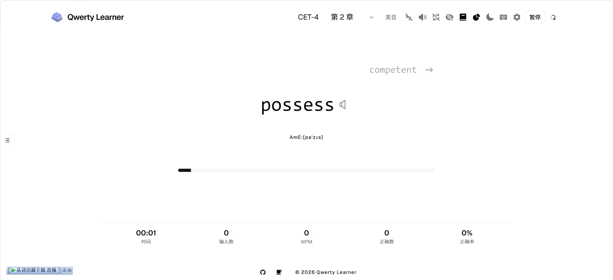

<p align="center">
  
  
  
  
  
  
</p>

<h1 align="center">Qwerty Learner</h1>

<p align="center">
  <strong>为键盘工作者设计的单词记忆与英语肌肉记忆锻炼软件</strong>
</p>

<p align="center">
  <a href="https://qwerty-learner-lihongzy.vercel.app/">Vercel</a> ·
  <a href="https://lihongzy.github.io/qwerty-learner/#/">GitHub Pages</a> ·
  <a href="#快速开始">快速开始</a> ·
  <a href="./DEVELOPMENT.md">开发文档</a>
</p>

---

> 它既不是词典应用，也不是打字游戏，而是一台将 **单词记忆**、**拼写巩固** 和 **键盘输入训练** 融为一体的练习器。

## ✨ 为什么选择 Qwerty Learner

传统背单词工具让你「看词选义」，但键盘工作者真正需要的是「想词打词」——在思考的同时，手指能下意识地把正确单词敲出来。

Qwerty Learner 把两者合成一套低摩擦的日常训练：

- **边记边打**：每个单词都必须完整打出，记忆和输入训练同步进行
- **即时反馈**：实时显示速度、正确率、耗时，形成可量化的练习闭环
- **错题驱动**：自动记录打错的单词，支持按错题集反复强化
- **无干扰界面**：极简设计，专注练习本身

## 🖼️ 界面预览

<p align="center">
  
</p>

## 🚀 在线体验

| 部署平台     | 地址                                                                                         |
| ------------ | -------------------------------------------------------------------------------------------- |
| Vercel       | [https://qwerty-learner-lihongzy.vercel.app/](https://qwerty-learner-lihongzy.vercel.app/)   |
| GitHub Pages | [https://lihongzy.github.io/qwerty-learner/#/](https://lihongzy.github.io/qwerty-learner/#/) |

## 🎯 功能特性

### 核心流程

- **章节式练习**：每个词库按章节拆分，每次练习一小段，保持专注度
- **多模式训练**：支持默写模式、听写模式，自由组合练习方式
- **复习模式**：基于历史错误数据自动生成复习词单，针对性强化
- **错题本**：完整的错题管理与导出功能，支持 Excel 导出

### 数据分析

- **速度与正确率趋势**：按时间维度查看每日练习表现
- **键盘热力图**：可视化各按键的输入速度和错误率分布
- **章节成绩记录**：每章练习完成后展示详细统计

### 词库覆盖

内置 **150+ 套词库**，覆盖全场景词汇需求：

| 类别       | 典型词库                                                  |
| ---------- | --------------------------------------------------------- |
| 中国考试   | CET-4/6、考研、专四/专八、高考                            |
| 国际考试   | IELTS、TOEFL、GRE、GMAT、BEC、SAT                         |
| 英语词典   | 牛津 5000、COCA 20000、朗文 3000、韦氏 Vocabulary Builder |
| 青少年英语 | 人教版 PEP（小/初/高）、北师大版、冀教版、剑桥            |
| 专业词汇   | 建筑、IT、生物医学、编程                                  |
| 代码练习   | JavaScript、Java、Go、C# 内置 API 词库                    |

### 个性化配置

- 多发音源切换（英音/美音）、语速调节
- 字体大小、颜色主题、随机/顺序排列
- 键盘布局适配（QWERTY / Dvorak / Colemak）
- 练习数据本地持久化，支持导入导出

### 桌面端

通过 Tauri 打包为桌面应用，体验更接近原生软件：

- 独立窗口运行，不受浏览器限制
- 更低的系统资源占用
- 本地数据完全私有

## 🛠️ 技术栈

| 分类     | 技术                                    |
| -------- | --------------------------------------- |
| 框架     | React 19 + TypeScript                   |
| 构建     | Vite 7                                  |
| 样式     | Tailwind CSS 4 + Radix UI + shadcn/ui   |
| 路由     | React Router 7                          |
| 状态管理 | Zustand + use-immer                     |
| 数据缓存 | SWR                                     |
| 本地存储 | Dexie (IndexedDB)                       |
| 图表     | ECharts                                 |
| 桌面端   | Tauri 2                                 |
| 工具库   | dayjs、xlsx、howler、canvas-confetti 等 |

## 🔧 快速开始

### 环境要求

- Node.js 18+
- pnpm（推荐）/ npm / yarn

### 本地开发

```bash
# 克隆仓库
git clone git@github.com:lihongzy/qwerty-learner.git
cd qwerty-learner

# 安装依赖
pnpm install

# 启动开发服务器
pnpm dev
```

浏览器打开 `http://localhost:1420` 即可开始练习。

### 构建与部署

```bash
# 生产构建
pnpm build

# 预览构建结果
pnpm preview

# 类型检查
pnpm tsc --noEmit
```

### 桌面端（Tauri）

```bash
pnpm tauri dev     # 开发模式
pnpm tauri build   # 生产构建
```

## 📁 项目结构

```
src/
├── app/          # 应用入口、路由、布局、Provider
│   ├── app.tsx
│   ├── layout/   # Shell 布局组件
│   └── router/   # 路由配置
├── pages/        # 按页面组织的业务模块
│   ├── typing/   # 练习主页面
│   ├── gallery/  # 词库浏览
│   ├── analysis/ # 数据分析
│   ├── error-book/  # 错题本
│   ├── friend-link/ # 友情链接
│   └── mobile/   # 移动端适配
├── shared/       # 跨页面共享
│   ├── components/  # 公共组件
│   ├── resources/   # 词典资源定义
│   ├── stores/      # 全局状态
│   ├── lib/db/      # Dexie 数据库
│   ├── types/       # TypeScript 类型
│   └── utils/       # 工具函数
└── assets/       # 静态资源
```

## 📖 文档

- [DEVELOPMENT.md](./DEVELOPMENT.md) — 详细的开发文档，包含数据结构、数据流、状态管理、常见任务等

## 🤝 贡献

欢迎任何形式的贡献——无论是提 Bug、给建议，还是直接提交代码。

- **发现 Bug**：直接在 [Issues](../../issues) 中描述问题
- **功能建议**：在 Issues 中发起讨论，确认方向后再动手
- **提交代码**：Fork → 新建分支 → 开发 → 提 PR

开始编码前建议先阅读 [DEVELOPMENT.md](./DEVELOPMENT.md)，里面有项目架构、数据流和开发约定的详细说明。

## 📄 致谢

本项目基于 [Kaiyiwing/qwerty-learner](https://github.com/Kaiyiwing/qwerty-learner) 重构而来，感谢原作者的优秀设计与海量词库积累。

## 📃 License

[MIT](./LICENSE)
