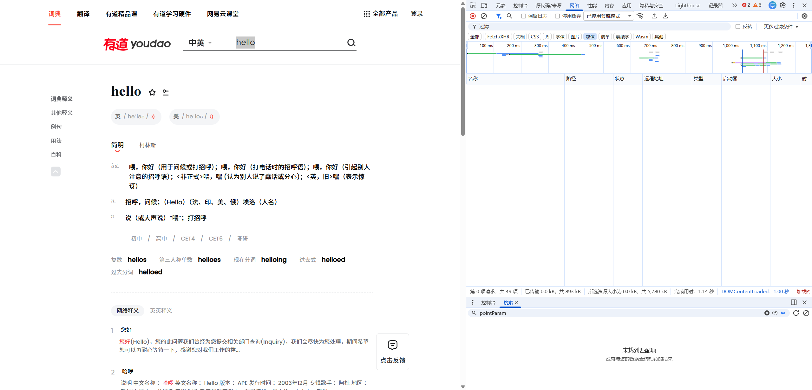
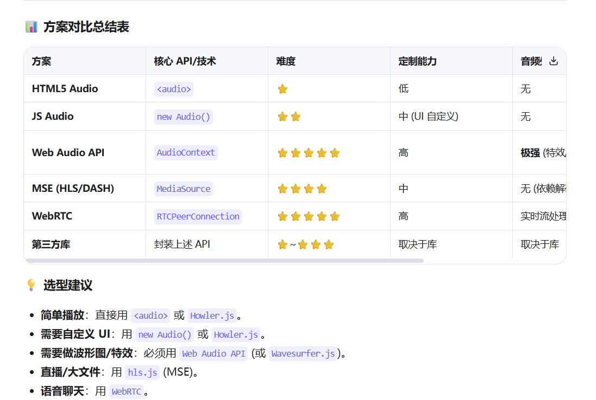
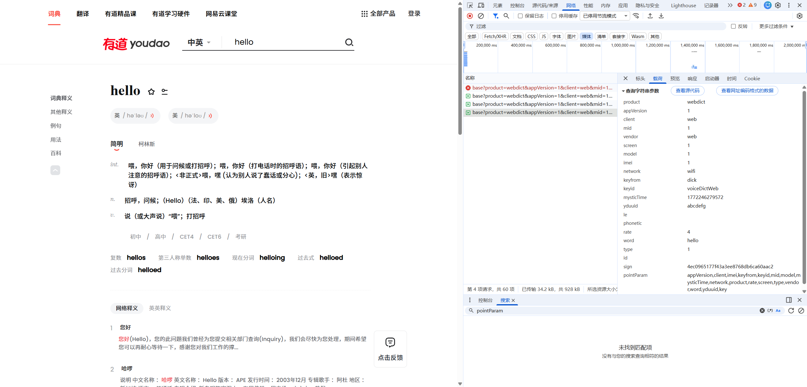
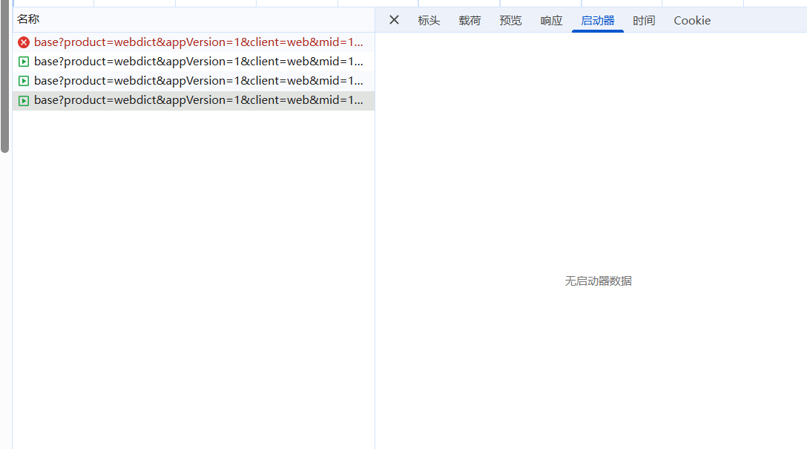
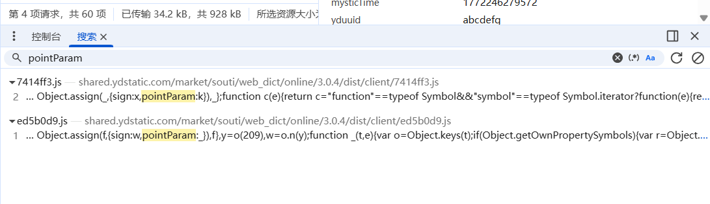
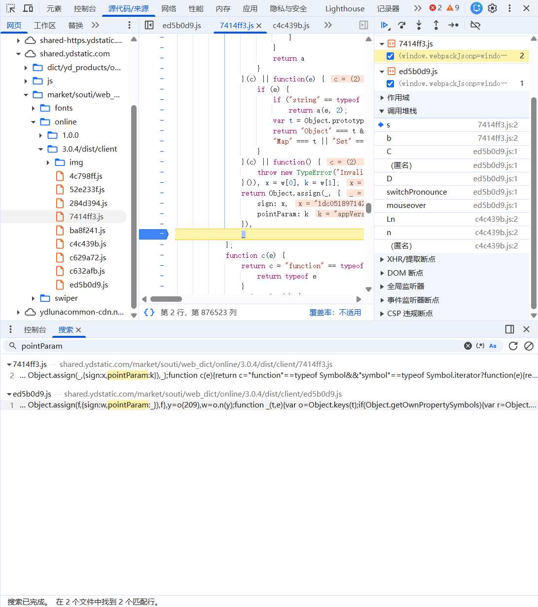
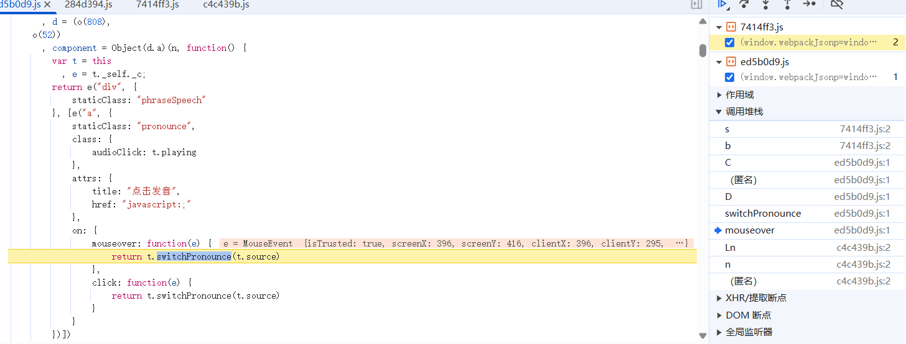
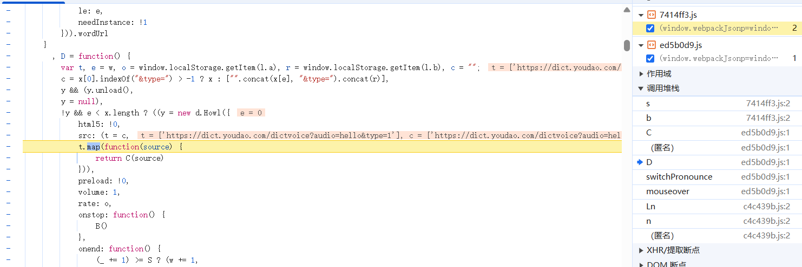

# 网易有道音频接口逆向

在这个项目中，我需要实现单词的音频播放功能。由于网易有道的音频播放接口不是公开的，需要进行逆向分析。

## 1. 发现音频请求

打开网易有道的音频播放页面，打开浏览器开发者工具（如 Chrome DevTools）。选中 **Network** 面板，清空网络日志。当点击有道的音频播放图标，或者鼠标悬停在音频播放图标上时，会发起网络请求去获取音频数据。


## 2. 分析音频实现方式

逆向分析网络请求时，首先要考虑音频播放有哪些实现方式。我们从最简单的方式开始分析：HTML5 `<audio>` 元素。


## 3. HTML5 Audio 元素的使用方式

`<audio>` 元素的使用方式比较简单，主要有以下几种：

### 方式一：设置 src 属性

在 HTML 中添加 `<audio>` 元素，设置 `src` 属性为音频 URL：

```html
<audio src="https://example.com/audio.mp3"></audio>
```

### 方式二：JavaScript 控制播放

通过 JavaScript 代码控制音频的播放、暂停等：

```javascript
const audio = new Audio('https://example.com/audio.mp3')
audio.play()   // 播放
audio.pause()  // 暂停
audio.stop()   // 停止
```

### 方式三：使用 source 元素切换音频

通过 `<source>` 元素可以切换不同的音频 URL：

```html
<audio controls>
  <source src="audio.mp3" type="audio/mpeg">
  <source src="audio.ogg" type="audio/ogg">
</audio>
```

> **参考文档：**
> - [MDN Web Docs - Audio](https://developer.mozilla.org/zh-CN/docs/Web/HTML/Element/audio)
> - [MDN Web Docs - Source](https://developer.mozilla.org/zh-CN/docs/Web/HTML/Element/source)

## 4. 逆向分析网络请求

这是拿到的网络请求，发现它有很多参数。


### 4.1 选择切入点参数

点击启动器分析调用栈时，发现没有直接暴露。此时选择搜索参数名。注意到 `sign` 参数很可能是加密算法生成的，调用点会非常多。而 `pointParam` 参数是明文，构建逻辑更简单，所以选择它作为切入点。

### 4.2 全局搜索参数

在源代码中全局搜索 `pointParam` 参数，找到了几个地方。由于结果较少，可以给这些地方都打上断点进行分析。



### 4.3 分析调用栈

打上断点后，分析调用栈。


从下往上粗略查看调用栈。当点击 `mouseover` 调用栈时，看到了"点击发音"中文字样。这说明有道没有做什么加密，只是简单地实现了音频播放功能。


> 注：并不是看到这个中文才发现的，而是在鼠标悬浮在音频图标上触发 `mouseover` 事件时意识到的。

### 4.4 找到音频 URL

继续分析，点击 `D` 调用栈时看到了一个 URL。


直接复制这个地址到浏览器中测试：

```
https://dict.youdao.com/dictvoice?audio=hello&type=1
```

发现可以成功播放音频！因此不需要继续分析 URL 的构建方式，直接使用这个接口即可实现音频播放功能。

## 5. 总结

这是一个非常简单的逆向分析过程。有道词典没有对音频接口做任何加密，只是简单地实现了音频播放功能。可以直接使用这个接口为自己的项目提供音频播放支持。

> **声明：** 本文仅作为学习使用，请勿用于商业目的。
